# 100x-engineer-hackathon# 100x Engineer: AI-Powered Market Intelligence Platform

🔗 [Live Demo](https://marketedgeagent.craftsmanlabs.net/)
📦 [Frontend Code Repository](https://github.com/CraftsMan-Labs/market-mind-scout)

## Overview

This project is an advanced AI-driven market intelligence platform designed to help businesses and entrepreneurs gain deep insights into market dynamics, customer needs, and strategic opportunities.

## Screenshots

### Market Intelligence Platform

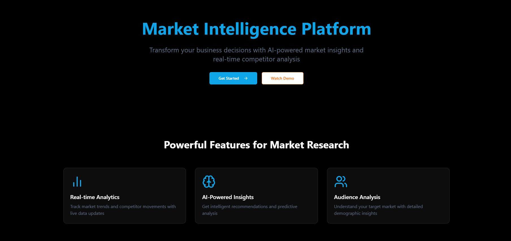
_Transform your business decisions with AI-powered market insights and real-time competitor analysis_

## System Architecture

### Knowledge Storage and Retrieval

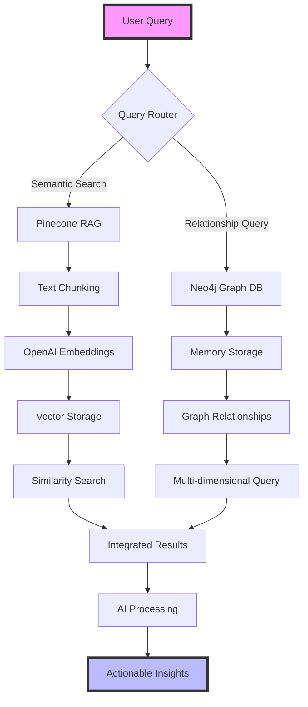

Our system leverages two powerful storage and retrieval mechanisms:

1. **Pinecone RAG (Retrieval-Augmented Generation)**

   - Automatic text chunking (500-word segments)
   - OpenAI embeddings (text-embedding-3-small model)
   - Vector similarity search
   - Efficient document retrieval with metadata

2. **Neo4j Graph Database**
   - Memory-based knowledge storage
   - Complex relationship mapping
   - Multi-dimensional querying capabilities
   - Temporal and contextual connections

This hybrid approach enables:

- Semantic search through vector embeddings
- Relationship-aware queries through graph traversal
- Combined insights from both structured and unstructured data

•⁠ ⁠[Detailed System Workflow](docs/workflow_visualizer/system_architecture.md)

## Product Workflow

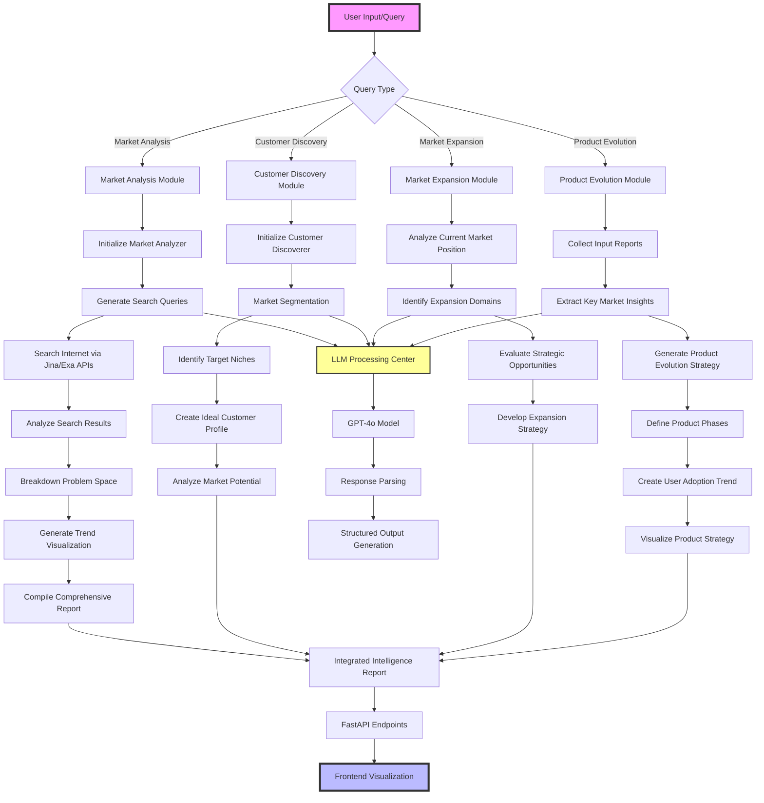

## Key Features

### 🔍 Market Analysis

•⁠ ⁠Comprehensive market research using advanced AI techniques
•⁠ ⁠Multi-source data aggregation and analysis
•⁠ ⁠Intelligent query breakdown and insight generation

### 🚀 Market Expansion

•⁠ ⁠Strategic market expansion recommendations
•⁠ ⁠Competitive landscape assessment
•⁠ ⁠Opportunity identification and prioritization

### 📈 Product Evolution

•⁠ ⁠Data-driven product evolution strategies
•⁠ ⁠Customer segment targeting
•⁠ ⁠Risk mitigation and success metrics tracking

## Backend Architecture

### Core Technologies

-⁠ ⁠*API Framework*: FastAPI
-⁠ ⁠*Authentication*: Supabase Auth
-⁠ ⁠*Primary Database*: Supabase PostgreSQL
-⁠ ⁠*Vector Database*: Pinecone
-⁠ ⁠*Graph Database*: Neo4j
-⁠ ⁠*Memory System*: Mem0
-⁠ ⁠*AI Integration*: LiteLLM, OpenAI
-⁠ ⁠*Search APIs*: Jina AI, Exa
-⁠ ⁠*Data Modeling*: Pydantic
-⁠ ⁠*API Documentation*: OpenAPI (Swagger)

### RAG (Retrieval Augmented Generation)

Our system implements three complementary RAG approaches:

1. **Vector RAG with Pinecone**
   - Document chunking and preprocessing
   - OpenAI embeddings generation
   - Semantic similarity search
   - Context-aware response generation
   - Metadata filtering and ranking

2. **Graph RAG with Neo4j**
   - Knowledge graph construction
   - Entity relationship mapping
   - Graph traversal queries
   - Context enrichment
   - Multi-hop reasoning

3. **Memory RAG with Mem0**
   - Semantic memory storage
   - Contextual memory retrieval
   - Memory-augmented responses
   - Long-term knowledge retention
   - Adaptive learning capabilities

### Authentication Flow

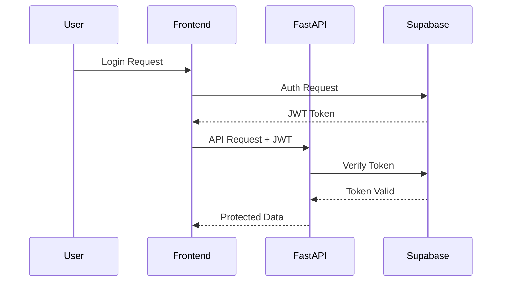

### Database Architecture

1. **Supabase PostgreSQL**
   - User profiles and preferences
   - Application state and configurations
   - Audit logs and analytics
   - Real-time subscriptions

2. **Pinecone Vector DB**
   - Document embeddings
   - Semantic search indices
   - Similarity matching
   - Dimension reduction

3. **Neo4j Graph DB**
   - Entity relationships
   - Knowledge graph
   - Contextual connections
   - Pattern matching

### API Documentation

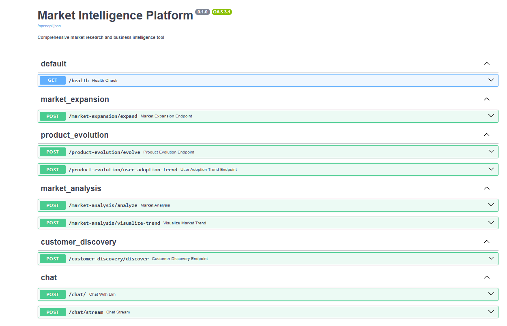
_Interactive API documentation with Swagger UI_

### API Structure

```python
src/
├── app/
│   ├── routers/
│   │   ├── market_analysis.py
│   │   ├── customer_discovery.py
│   │   ├── market_expansion.py
│   │   ├── product_evolution.py
│   │   └── chat.py
│   ├── db.py          # Database connections
│   ├── auth.py        # Supabase authentication
│   ├── pinecone.py    # Vector store operations
│   ├── neo4j.py       # Graph operations
│   ├── mem0_client.py # Memory operations
│   └── main.py        # FastAPI application
```

## Getting Started

### Prerequisites

•⁠ ⁠Python 3.10+
•⁠ ⁠Poetry (dependency management)

### Installation

⁠ bash
git clone https://github.com/yourusername/100x-engineer.git
cd 100x-engineer
poetry install
 ⁠

### Environment Configuration

Create a ⁠ .env ⁠ file with the following variables:
•⁠ ⁠⁠ OPENAI_API_KEY ⁠
•⁠ ⁠⁠ JINA_API_KEY ⁠
•⁠ ⁠⁠ EXA_API_KEY ⁠

### Running the Application

1. **Start the Backend Server**
   ```bash
   # Start FastAPI server
   uvicorn src.app.main:app --reload --port 8000
   ```

2. **Access the API Documentation**
   - Open http://localhost:8000/docs for Swagger UI
   - Open http://localhost:8000/redoc for ReDoc

3. **Run Tests**
   ```bash
   # Run all tests
   pytest
   
   # Run with coverage report
   pytest --cov=src
   ```

## Core Modules

•⁠ ⁠*Customer Discovery*: Advanced customer segmentation

•⁠ ⁠*Market Analysis*: Comprehensive market research

•⁠ ⁠*Market Expansion*: Strategic growth recommendations

•⁠ ⁠*Product Evolution*: Data-driven product strategy

For detailed product analysis and market insights, check out our:

- [Comprehensive Market Analysis Report](sample_comprehensive_reports/FINAL_REPORT.md)
- [Sample Reports Collection](sample_comprehensive_reports/)

## Workflow Visualizations

Detailed workflow diagrams are available to understand the internal processes of our core modules:

### 📊 Workflow Visualizers

•⁠ ⁠[Customer Discovery Workflow](docs/workflow_visualizer/customer_discovery.md)

•⁠ ⁠[Market Analysis Workflow](docs/workflow_visualizer/market_analyser.md)

•⁠ ⁠[Market Expansion Workflow](docs/workflow_visualizer/market_expansion.md)

•⁠ ⁠[Product Evolution Workflow](docs/workflow_visualizer/product_evolution.md)

•⁠ ⁠[Competitive Analysis Workflow](docs/workflow_visualizer/competitive_analysis.md)

These Mermaid-based flowcharts provide insights into the AI-driven processes powering our intelligent market research platform.

## Contributing

1.⁠ ⁠Fork the repository
2.⁠ ⁠Create your feature branch (⁠ git checkout -b feature/AmazingFeature ⁠)
3.⁠ ⁠Commit your changes (⁠ git commit -m 'Add some AmazingFeature' ⁠)
4.⁠ ⁠Push to the branch (⁠ git push origin feature/AmazingFeature ⁠)
5.⁠ ⁠Open a Pull Request

## License

Distributed under the MIT License. See ⁠ LICENSE ⁠ for more information.

## Contact

- Rishub C R - rishub@craftsmanlabs.net - https://www.linkedin.com/in/rishub-c-r/ - Craftsmanlabs.net
- Nazim Girach - https://www.linkedin.com/in/nazim-girach/
- Irshad Girach - https://www.linkedin.com/in/irshad-girach-42b88a189/
- Ammar Khatri - https://www.linkedin.com/in/ammar-khatri-458544211/

## Application Screenshots

### Dashboard Overview

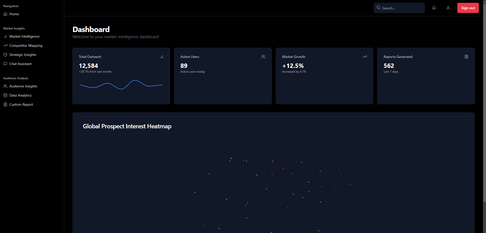
_Real-time market intelligence dashboard with key metrics and global prospect heatmap_

### Competitor Analysis

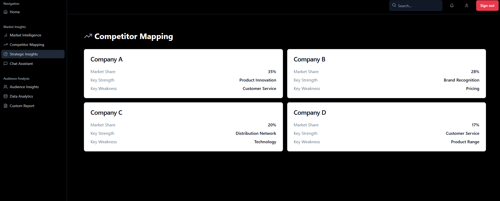
_Detailed competitor mapping with market share and SWOT analysis_

### Strategic Planning


_Strategic insights dashboard showing growth opportunities and market trends_

### AI Chat Assistant

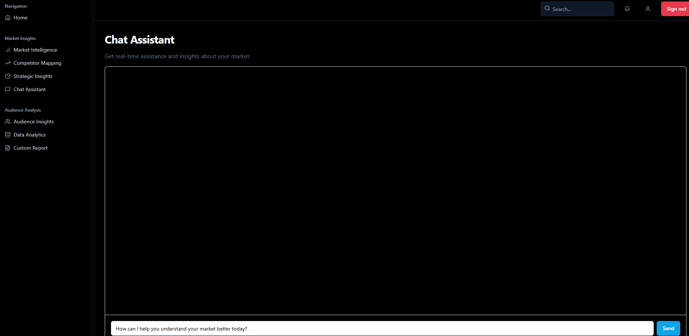
_AI-powered chat assistant for real-time market insights_

### Audience Analytics

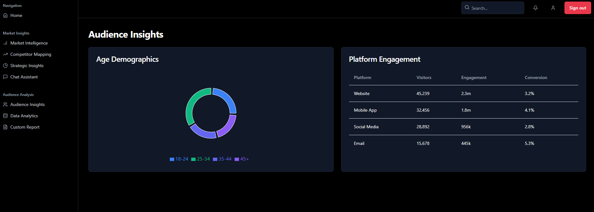
_Detailed audience demographics and platform engagement metrics_

### Performance Analytics

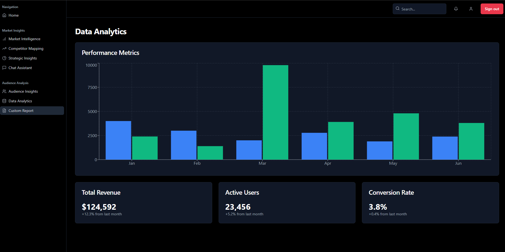
_Comprehensive performance metrics and trend analysis_

### Custom Reporting

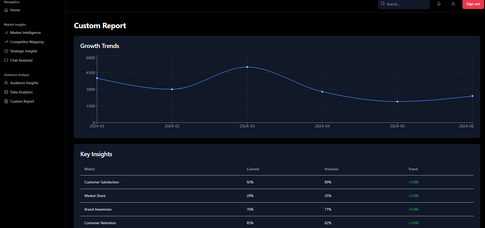
_Customizable reporting with growth trends and key business insights_
