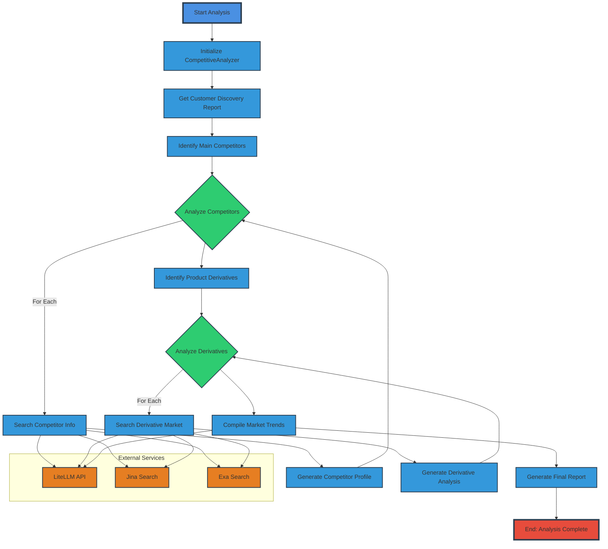

# Competitive Intelligence Analysis Workflow

```mermaid
flowchart TD
    A[Start Analysis] --> B[Initialize CompetitiveAnalyzer]
    B --> C[Get Customer Discovery Report]
    
    C --> D[Identify Main Competitors]
    D --> E{Analyze Competitors}
    E --> |For Each| F[Search Competitor Info]
    F --> G[Generate Competitor Profile]
    G --> E
    
    E --> H[Identify Product Derivatives]
    H --> I{Analyze Derivatives}
    I --> |For Each| J[Search Derivative Market]
    J --> K[Generate Derivative Analysis]
    K --> I
    
    I --> L[Compile Market Trends]
    L --> M[Generate Final Report]
    M --> N[End: Analysis Complete]

    subgraph "External Services"
        O[LiteLLM API]
        P[Jina Search]
        Q[Exa Search]
    end

    F --> O & P & Q
    J --> O & P & Q
    L --> O
    
    classDef start fill:#4a90e2,stroke:#2c3e50,stroke-width:4px
    classDef process fill:#3498db,stroke:#2c3e50,stroke-width:2px
    classDef decision fill:#2ecc71,stroke:#2c3e50,stroke-width:2px
    classDef external fill:#e67e22,stroke:#2c3e50,stroke-width:2px
    classDef endNode fill:#e74c3c,stroke:#2c3e50,stroke-width:4px

    class A,N start
    class B,C,D,F,G,H,J,K,L,M process
    class E,I decision
    class O,P,Q external
    class N endNode
```
