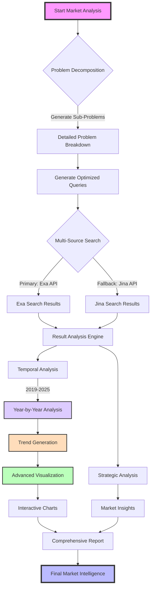

# Market Analyzer Workflow Diagram

> Visualizes the comprehensive process of market analysis using advanced AI techniques and multi-source data integration

## Overview
This Mermaid.js diagram illustrates the enhanced workflow of the MarketAnalyzer class, 
demonstrating how complex market research is conducted through intelligent decomposition, 
multi-source data gathering, trend analysis, and visualization.

## Key Processes
- Problem Decomposition
- Multi-Source Data Collection
- Temporal Analysis
- Advanced Trend Visualization
- Strategic Insights Generation
- Comprehensive Reporting

## Process Details
1. **Problem Decomposition**: Breaks down complex market queries into focused sub-problems
2. **Multi-Source Search**: Leverages both Exa and Jina APIs for comprehensive data gathering
3. **Temporal Analysis**: Detailed year-by-year market evolution from 2019 to 2025
4. **Advanced Visualization**: Dynamic trend visualization with multiple metrics
5. **Strategic Insights**: AI-powered analysis of market patterns and opportunities
